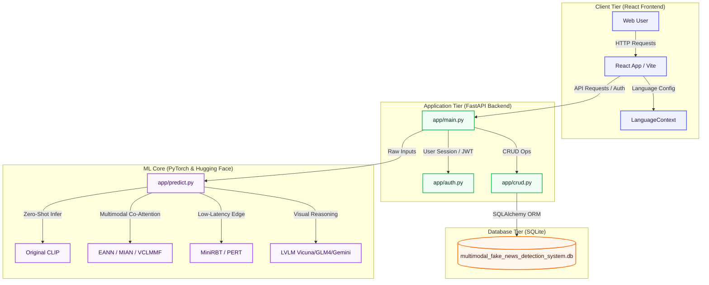

# 🔍 Multimodal Fake News Detection Platform

A comprehensive research platform and interactive web dashboard for benchmarking and deploying advanced architectures in **Multimodal Fake News Detection**. The platform evaluates **16 model architectures** across **6 key paradigms**, including classical baselines, foundation vision-language models, edge-optimized models, and cutting-edge 2025/2026 state-of-the-art models on the multilingual **M4FC Dataset**.

---

## 🚀 System Architecture

The application is structured as a decoupled, high-performance web suite. Below is the interaction workflow between the client, backend APIs, SQLite storage, and the deep learning inference engines:



---

## 📋 Setup & Deployment Guide

### Local Development Setup

#### 1. Clone the Repository
```bash
git clone https://github.com/YOUR_USERNAME/multimodal-fake-news-detection.git
cd multimodal-fake-news-detection
```

#### 2. Configure Python Virtual Environment
Create and activate the environment for running notebooks and running the backend API:
```bash
# Create the virtual environment
python -m venv venv_ai

# Activate (Windows)
venv_ai\Scripts\activate

# Activate (Linux/Mac)
source venv_ai/bin/activate

# Install dependencies
pip install -r requirements.txt
```

#### 3. Run the FastAPI Backend Server
Navigate to the `app` directory, configure the `.env` parameters if needed, and start the server:
```bash
cd app
uvicorn main:app --reload --host 0.0.0.0 --port 8000
```
The backend server runs locally on **`http://localhost:8000`**.

#### 4. Run the React Frontend
Open a new terminal, navigate to the `react-frontend` directory, install Node dependencies, and start Vite:
```bash
cd react-frontend
npm install
npm run dev
```
The frontend application will start on **`http://localhost:3000`**.

---

## ⚡ Live Demo, Quickstart & Example Outputs

- **Live Demo (local):**
  - Frontend: `http://localhost:3000`
  - Backend docs: `http://localhost:8000/docs`
- **Quickstart:** clone the repository, install Python + Node dependencies, then run backend and frontend servers as shown above.
- **Example outputs:** benchmark figures and reports are available under:
  - `reports/clip/figures/clip_comparison_summary.png`
  - `reports/mian/figures/mian_confusion_matrix.png`
  - `reports/vclmmf/figures/roc_curve.png`
  - `reports/*/metrics/*.txt`

---

## ❤️ Support This Project

If this project helps your research, coursework, or product exploration, please consider sponsoring it.

### Sponsor Links

- **GitHub Sponsors:** https://github.com/sponsors/Safae26
- **Patreon:** https://www.patreon.com/safaeeraji
- **OpenCollective:** https://opencollective.com/multimodal-fake-news-detection
- **Buy Me a Coffee:** https://buymeacoffee.com/safaeeraji

### Why Sponsorship Matters

Sponsorship directly supports:
- M4FC dataset acquisition, refresh, and curation
- GPU/compute costs for training and benchmarking
- Hosting and infrastructure for API + frontend availability
- Ongoing model maintenance, evaluation, and documentation quality

---

## 🧭 Public Roadmap (Sponsor-Unlocked Priorities)

- [ ] Add expanded multilingual benchmarks and error analysis across all supported languages
- [ ] Publish reproducible benchmark pipelines with standardized experiment tracking
- [ ] Release model cards and deployment profiles for edge and cloud inference
- [ ] Improve explainability outputs (cross-modal evidence attribution + uncertainty views)
- [ ] Add one-click deployment guides (Docker + Vercel + API hosting options)
- [ ] Expand contributor onboarding docs and starter issues for research collaboration

---

## 🤝 Trust, Contribution & Community

- Read contribution guidelines: **[CONTRIBUTING.md](CONTRIBUTING.md)**
- Open issues for bugs, research questions, and feature requests
- Submit peer feedback through the app (`About > User Reviews`)
- Follow and share progress updates on:
  - GitHub: https://github.com/Safae26
  - LinkedIn: https://www.linkedin.com/in/safae-eraji-230083270
  - Relevant communities: Reddit ML forums, Hugging Face community spaces, and OSS AI groups

---

## 🌟 Sponsor Recognition

Sponsors are thanked publicly in:
- README sponsor acknowledgments
- Release notes
- Milestone/update announcements

Optional sponsor perks can include:
- Early access to benchmark summaries
- Priority consideration for feature requests
- Public acknowledgments in project updates

---

## 🧠 Benchmarked Model Architectures

This project implements and compares **16 neural network models** spanning 6 distinct paradigms:

| Paradigm | Model Family | Key Architecture / Feature Fusion | Target Paper / Reference |
| :--- | :--- | :--- | :--- |
| **I. State of the Art** | **LVLM (Vicuna/GLM4)** | Large Vision-Language Model Zero-Shot reasoning | *2025/2026 Baseline* |
| | **MIAN** | Hierarchical Learning Module (HLM) + Co-Attention + Inverse Attention | *IJCAI 2025* |
| | **VCLMMF** | Probabilistic VAE Alignment + InfoNCE Dual Contrastive Loss | *2025* |
| **II. Foundational** | **CLIP** | Zero-Shot Cosine Similarity / Supervised MLP Classifier | Radford et al., *ICML 2021* |
| | **BLIP** | Bootstrapping Language-Image Captioning Matching | Li et al., *ICML 2022* |
| | **VisualBERT** | Single-Stream Joint Transformer Adapter | Li et al., *arXiv 2019* |
| **III. Adversarial** | **EANN** | Event Adversarial Neural Network with Domain Classifier | Wang et al., *KDD 2018* |
| | **CAFE** | Ambiguity-Aware Cross-Modal Learning & Uncertainty | Zhou et al., *CVPR 2021* |
| **IV. Attention** | **HMCAN** | Hierarchical Contextual Attention Network (Text/Image/Metadata) | *ACL* |
| | **att-RNN** | Joint Visual-Textual Attention with Bi-GRU + VGG-19 | Jin et al., *IJCAI 2017* |
| | **SpotFake** | BERT Text + VGG-19 Image Concatenation | Singhal et al., *IEEE MIPR 2019* |
| | **SpotFake+** | XLM-RoBERTa + ResNet-50 Image Concatenation | Singhal et al., *AAAI 2020* |
| **V. Variational & Fusion** | **MVAE** | Multimodal Variational Autoencoder (Generative Reconstruction) | Khattar et al., *WWW 2019* |
| | **SAFE** | Similarity-Aware Fusion Engine (Cross-Modal Correlation) | Zhou et al., *PAKDD 2020* |
| | **Traditional Fusion**| Early Fusion (Concatenation) / Late Fusion (Voting Classifier) | *Baseline* |
| **VI. PEFT \& Edge Optimization** | **MiniRBT** | Distilled mini-RoBERTa (5x compression, fast edge deployment) | *Edge optimized* |
| | **PERT** | Parameter-Efficient Fine-Tuned (PEFT) Masking Transformer | *Edge optimized* |

---

## 📂 Project Structure

```text
multimodal_fake_news_detection/
├── app/                      # FastAPI Backend Server
│   ├── main.py               # Main Entrypoint (API endpoints & server config)
│   ├── auth.py               # JWT authentication & password security
│   ├── database.py           # SQLite connection & sessionmaker
│   ├── crud.py               # Database CRUD helpers
│   ├── models.py             # SQL Alchemy schemas (User, ClaimRecord)
│   ├── schemas.py            # Pydantic schemas (predict & user)
│   ├── predict.py            # Deep learning inference engine loader
│   ├── twitter_stream.py     # Real-time ingestion stream (Twitter API)
│   ├── create_admin.py       # Helper script to create admin user
│   ├── reset_admin.py        # Helper script to reset admin password
│   ├── Dockerfile            # Docker configuration for FastAPI
│   └── requirements.txt      # Minimal CPU-optimized packages
├── react-frontend/           # React + Vite + Tailwind CSS Dashboard
│   ├── src/
│   │   ├── pages/            # View pages (Home, Models, History, Analyzer, About)
│   │   ├── components/       # Reusable components (Charts, Navbar, Stream)
│   │   └── context/          # State management context (Language, Alerts)
│   └── vercel.json           # Vercel deployment configuration
├── src/                      # Modular Production ML Pipeline
│   ├── data_pipeline.py      # M4FC custom dataloaders & padding
│   └── model_registry.py     # Registry for model weights loading
├── data/                     # Data storage directory
├── models/                   # Pre-trained models and weights directory
├── notebooks/                # PyTorch Implementation Jupyter Notebooks
├── M4FC/                     # Official dataset submodule / clone
├── figures/                  # Static assets & model architecture diagrams
├── reports/                  # Generated evaluation reports (classification report text & figures)
├── download_with_retry.py    # Script for downloading dependencies/data
├── requirements.txt          # Global packages (including GPU wheels)
└── requirements_data.txt     # Data-specific Python dependencies
```

---

## 📄 License

This project is licensed under a custom **Non-Commercial Software License** (Exclusive Commercial Rights retained by Safae Eraji). It is free for personal, educational, and academic research purposes, but commercial use by any third party is strictly prohibited. Refer to the [LICENSE](LICENSE) file for the full terms and conditions.
